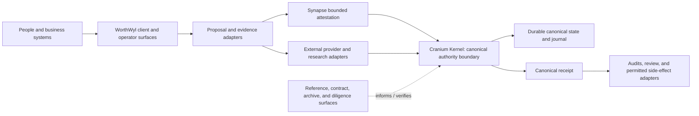
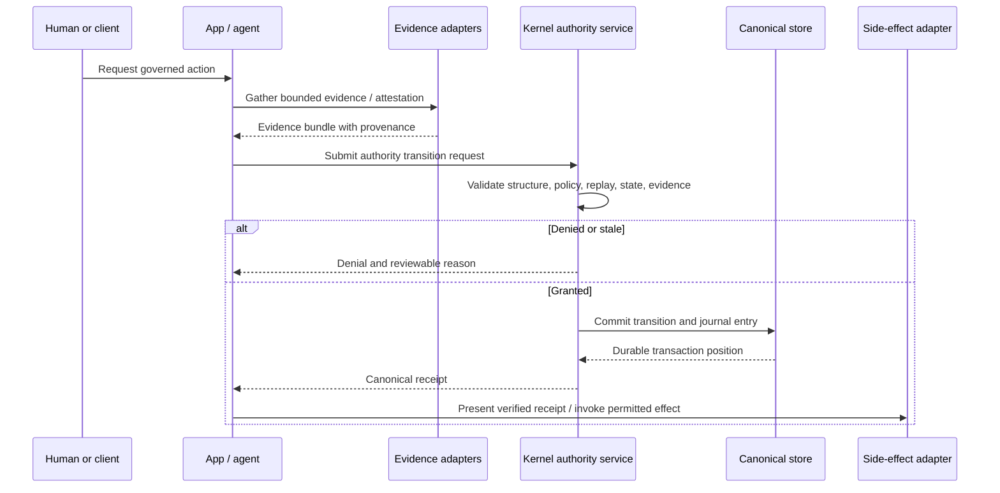

# WorthWyl — Cranium AI Master Dossier

## Governed Intelligence Infrastructure for Accountable AI Action

**Dossier date:** 2026-09-12  
**Prepared for:** WorthWyl  
**Prepared by:** Product Strategy & Technical Writing  
**Scope:** Repository-led technical, product, and acquisition assessment  
**Source set:** Full supplied inventory of 18 public repository records, supplemented by the verified core repository research provided for this dossier.

> **Decision-grade framing.** This dossier separates what is **observed** in the supplied repository research and inventory from **interpretation** and **recommendation**. It does not treat demonstrations, fixtures, local browser state, generated reports, documentation claims, or archive artifacts as proof of a production authority service. It does not make legal ownership, security-certification, deployment, revenue, or competitive-performance claims that are not supported by the supplied evidence.

---

## Contents

1. [Executive thesis](#1-executive-thesis)  
2. [Assumptions and verification status](#2-assumptions-and-verification-status)  
3. [Ecosystem overview](#3-ecosystem-overview)  
4. [Repository portfolio](#4-repository-portfolio)  
5. [Canonicality and governance model](#5-canonicality-and-governance-model)  
6. [Architecture narrative](#6-architecture-narrative)  
7. [Cranium AI product layer](#7-cranium-ai-product-layer)  
8. [Real-world intelligence and voice](#8-real-world-intelligence-and-voice)  
9. [Competitive positioning](#9-competitive-positioning)  
10. [Use cases](#10-use-cases)  
11. [Business and acquisition value](#11-business-and-acquisition-value)  
12. [Roadmap](#12-roadmap)  
13. [Risks and gaps](#13-risks-and-gaps)  
14. [Operating model](#14-operating-model)  
15. [Suggested evidence package](#15-suggested-evidence-package)  
16. [Conclusion](#16-conclusion)  
17. [References](#references)

---

## 1. Executive thesis

**Observed.** The supplied research identifies **`cranium-kernel` as the sole canonical authority boundary** for the documented Cranium architecture. Its stated role is to evaluate governed authority-transition requests, apply replay, boundary, evidence, and constitutional checks, reduce accepted state changes, issue receipts, and provide the persistence/write boundary. The repository presents TypeScript and Kotlin implementation surfaces, a browser review/demo UI, semantic-contract materials, and verification tooling. Its own documentation also distinguishes those supporting surfaces from the canonical authority path and explicitly disclaims production certification and several hardening requirements. [9]

**Interpretation.** The strategic asset is therefore not a generic model wrapper or a conventional conversational assistant. It is an emerging **governed-action substrate**: a control-plane design in which cognitive systems may propose or attest, while a narrowly defined authority service decides whether a protected state change may occur. If made operationally complete, this separation can make high-consequence AI workflows more reviewable, repeatable, and controllable than workflows that collapse reasoning, tool use, persistence, and user presentation into one opaque application flow.

**Proposed positioning.** WorthWyl should position Cranium AI as **accountable intelligence infrastructure for governed decisions and actions**. The primary promise is not that Cranium “knows more” than a general AI assistant. The primary promise is that an organization can define what constitutes an admissible proposal, bind evidence and policy to the decision, deny unsafe or stale transitions, persist an authorized transition, and retain a receipt trail before downstream effects occur. This is a positioning hypothesis, not a claim that the current repositories already constitute a production-grade service.

**Strategic conclusion.** The portfolio is strongest when treated as a coherent but unfinished architecture-and-evidence program centered on the Kernel. It contains valuable reference implementations, conformance materials, benchmarks, operator/diligence shells, provider adapters, and historical provenance surfaces. The immediate product and acquisition task is to convert the portfolio’s documented boundary discipline into one versioned, independently testable, securely operated authority service with a small number of evidence-rich vertical workflows.

| Thesis element | Status | Decision implication |
|---|---|---|
| A sole canonical authority source is documented as `cranium-kernel`. | **Observed** in supplied research. [9] | Make Kernel contract, code, releases, and operating controls the portfolio center of gravity. |
| Synapse and external providers are bounded evidence/cognition surfaces rather than authority issuers. | **Observed** for `cranium-synapse` and provider gateway documentation. [15] [12] | Preserve a hard evidence-to-authority boundary in every product integration. |
| The wider repository set provides portfolio breadth but includes archive, demo, fixture, and documentation layers. | **Observed** across researched repositories and inventory. [1] [3] [7] [10] [11] [13] | Catalog and govern surfaces rather than presenting all repositories as equivalent production assets. |
| A governed-action platform can be differentiated from a general assistant. | **Interpretation / proposed positioning.** | Validate with controlled pilots, customer discovery, and measurable operational outcomes. |
| Production readiness, independent verification, legal title, and deployment posture are established. | **Not verified.** | Treat as diligence gates, not marketing assertions. |

---

## 2. Assumptions and verification status

### 2.1 Evidence taxonomy

This dossier uses the following labels consistently. An **observed** statement reflects the supplied inventory or verified repository research. An **interpretation** connects observed facts into a strategic inference. A **recommendation** is a proposed action. **Not verified** means the supplied materials do not establish the claim; it must not be promoted as fact.

| Label | Meaning in this dossier | Appropriate use |
|---|---|---|
| **Observed — verified research** | The statement is supported by the supplied repository research, which identified specific documentation, source paths, interfaces, or test/harness observations. | Architecture boundary, repository roles, named source surfaces, and stated gaps. |
| **Observed — inventory only** | The statement is limited to the repository inventory metadata: name, description, primary language, default branch, public/private field, archive flag, or update timestamp. | Portfolio coverage without inferring uninspected implementation behavior. |
| **Interpretation** | A reasoned product, business, or technical synthesis of observed material. | Strategic thesis, portfolio cohesion, buyer relevance, and relative priority. |
| **Recommendation** | A proposed operating, product, diligence, or roadmap step. | What WorthWyl should do next. |
| **Not verified** | The supplied evidence does not demonstrate the claim. | Production deployment, customer adoption, security posture, licensing closure, or voice operation. |

### 2.2 Working assumptions

The analysis assumes that the supplied inventory is the intended full repository population as of the dossier date and that the supplied “verified core research” accurately reflects the inspected repository content at its research point. The inventory identifies all 18 repositories as not technically archived in its `archived` metadata field. Several repository documents, however, reportedly label their own content as **archived lineage**. This difference is material: a GitHub metadata flag and a documentation-level lifecycle designation are not equivalent and should be reconciled during diligence.

The analysis also assumes that repository descriptions are descriptive metadata rather than proof of runtime behavior. No inference is made from a repository name, language, UI, ZIP artifact, mocked result, generated receipt, or static benchmark alone. Statements about external AI services are limited to documented adapter surfaces and explicitly exclude any assertion that credentials, external connectivity, or production service behavior has been demonstrated.

### 2.3 Verification matrix

| Topic | Current verification status | Basis | Required next proof |
|---|---|---|---|
| Canonical authority designation | **Verified research** | Kernel and supporting repositories reportedly name `cranium-kernel` as the sole canonical authority source. [9] [3] [15] | Pin the current commit and release a signed, versioned canonicality charter. |
| Kernel semantic boundary | **Verified research** | Documentation and named engine/reducer/proxy files describe proposal evaluation, commit, receipts, and replay handling. [9] | Run and preserve exact reproducibility and conformance results against a pinned revision. |
| Synapse as evidence, not authority | **Verified research** | The supplied research describes typed attestation and explicit prohibition on authority issuance/state writes. [15] | Test an end-to-end rejected and accepted path through the Kernel. |
| Provider adapters | **Verified research** | A Node/Express gateway documents Claude and Perplexity adapters and route selection; external behavior remains unverified. [12] | Run credential-free and mocked-provider contract tests; then conduct controlled live integration tests. |
| Real-world research capability | **Partially observed** | Research/news routes and citations are documented for one provider gateway. [12] | Establish source-quality, freshness, citation, and provenance acceptance criteria in the Kernel path. |
| Voice capability | **Not verified** | No supplied inventory description or verified research establishes speech input, speech output, telephony, streaming audio, or voice identity controls. | Build and test a bounded voice adapter only after governance, consent, and audit requirements are defined. |
| Production authority service | **Not verified** | Kernel documents state several hardening and topology gaps. [9] | Demonstrate authenticated transport, secret custody, durable storage, access control, backup/restore, monitoring, and multi-node resilience. |
| Independent security assurance | **Not verified** | Kernel documentation reportedly disclaims external certification. [9] | Complete threat model, code review, penetration testing, dependency/supply-chain review, and remediation evidence. |
| Legal/IP transferability | **Not verified** | Multiple provenance and handover records reportedly leave ownership, assignment, third-party, and licensing questions open. [1] [3] [4] [7] [10] [11] [13] | Execute counsel-led chain-of-title, contributor, OSS, asset, and trademark diligence. |
| Commercial traction and economic performance | **Not verified** | No customer, revenue, retention, or deployed-service evidence was supplied. | Provide customer contracts, cohort/usage data, unit economics, security questionnaires, and references if applicable. |

---

## 3. Ecosystem overview

**Observed.** The full inventory contains 18 repositories spanning a canonical kernel, contract and attestation materials, research/reference harnesses, operator and client surfaces, provider adapters, acquisition/diligence workbenches, portfolio/documentation repositories, archive material, and several repositories for which only inventory metadata was provided. The inventory identifies TypeScript, JavaScript, Python, Kotlin, and documentation-only surfaces. [1] [2] [3] [4] [5] [6] [7] [8] [9] [10] [11] [12] [13] [14] [15] [16] [17] [18]

**Interpretation.** This is best understood as a **portfolio of layers**, not as eighteen independent products. Its organizing logic is strongest when the layers are ranked by authority and evidence: the Kernel defines the authority boundary; Synapse and providers supply bounded cognitive/evidence inputs; application shells create user experiences; reference and simulator repositories preserve experiments; and archive, portfolio, and acquisition surfaces organize provenance and diligence. Without that hierarchy, repository duplication, historical naming, and demo material can create false impressions of multiple competing cores.



*Figure 1. **Proposed ecosystem map** synthesized from the documented boundaries. It is not a deployment diagram and does not prove that every arrow is implemented or live.*

### 3.1 Layer model

| Layer | Role in the ecosystem | Primary evidence status | Boundary rule |
|---|---|---|---|
| **Authority kernel** | Evaluates governed transition proposals, applies policy/boundary/replay rules, commits accepted state, and issues receipts. | Verified research for `cranium-kernel`. [9] | Only this layer may establish canonical authority, state, and receipts under the stated design. |
| **Cognition and attestation** | Generates assessment, risk disposition, provenance, and attestation information. | Verified research for `cranium-synapse`; supporting research surfaces elsewhere. [15] [4] [13] | May inform an authority decision; may not decide or commit it. |
| **Provider and real-world intelligence** | Routes requests to external AI/research providers and returns provider-scoped outputs. | Verified research for `cranium-provider-integrations`. [12] | Must remain untrusted input until validated and bound by the Kernel. |
| **Product and operator experience** | Presents workspaces, review, creator, metacognition, diligence, and operator interfaces. | Verified research for operator/workbench; inventory-only for other clients. [7] [10] [16] [17] [18] | Local UI state and displayed outcomes are non-canonical. |
| **Reference, benchmark, and simulator** | Preserves concepts, corpus material, harnesses, evaluations, and historical implementations. | Verified research for cognitive core/reference; inventory-only for simulator. [4] [13] [14] | May test, explain, or inspire; may not redefine canonical semantics. |
| **Portfolio, archive, and transfer** | Curates historical material, provenance records, acquisition templates, and documentation. | Verified research for acquisition/portfolio; inventory-only for archive/content hub. [1] [2] [5] [11] | Documentation and ZIPs are evidence artifacts, not authority services. |

### 3.2 Portfolio design principle

> **Cognition can propose; evidence can attest; authority alone may commit.**

This principle is the coherent through-line in the supplied research. It should become the portfolio’s plain-language contract and product design rule. Any client, model, agent, provider adapter, simulator, or analyst workflow can be useful, but none should silently obtain the right to change protected state or invoke a consequential downstream action. The product value emerges only when the boundary is reliably implemented, usable, and visible to the people responsible for outcomes.

---

## 4. Repository portfolio

### 4.1 Complete repository inventory and portfolio classification

The following table covers the full supplied inventory. “Evidence tier” distinguishes repositories covered by verified core research from those for which this dossier received inventory metadata only. An inventory-only classification is deliberately narrow and does not infer files, runtime behavior, integration state, or canonicality beyond the description supplied.

| # | Repository | Primary language | Observed repository role | Canonicality / lifecycle reading | Evidence tier |
|---:|---|---|---|---|---|
| 1 | `cranium-acquisition-template` [1] | TypeScript | Acquisition-governance and delivery template with documented hardened-core, Kotlin, ZIP, CI, and GitHub App skeleton surfaces in supplied research. | **Non-canonical archive wrapper**; its own archive record reportedly points to Kernel. | Verified research |
| 2 | `cranium-archive` [2] | Not specified | Historical archive, provenance, brand assets, and constitutional records, per inventory. | **Inventory-only**; a likely archive/provenance surface, not independently inspected here. | Inventory only |
| 3 | `cranium-canonlane-contracts` [3] | Python | Historical CanonLane/semantic-contract documentation, protocol corpus, and independent verifier. | **Supporting / archived lineage**; research explicitly says Kernel owns current authority semantics. | Verified research |
| 4 | `cranium-cognitive-core` [4] | Python | Cognitive data-model and research surface with Kotlin-adjacent material, project review concepts, corpus, and audit harnesses. | **Supporting / historical**; not a canonical authority runtime. | Verified research |
| 5 | `cranium-content-hub` [5] | Not specified | Technical and acquisition-facing Cranium documentation, per inventory. | **Inventory-only**; documentation surface only as described. | Inventory only |
| 6 | `Cranium-Core-` [6] | Kotlin | Application and cognitive-layer integration surface, per inventory. | **Inventory-only**; supporting status is stated in its inventory description. | Inventory only |
| 7 | `cranium-diligence-workbench` [7] | TypeScript | React/Vite review workbench, frozen fixtures, integrity utilities, and optional Gemini-backed routes. | **Supporting / archived lineage / demonstration**; no authority issuance. | Verified research |
| 8 | `cranium-hardened-core` [8] | TypeScript | Hardened Cranium Core reference implementation, per inventory. | **Inventory-only**; classified as supporting by inventory description. It must not be conflated with similarly named nested material in another repository. | Inventory only |
| 9 | `cranium-kernel` [9] | TypeScript | Cranium Substrate v1 authority kernel with governed transitions, contracts, receipts, replay handling, persistence boundary, and supporting UI/tooling. | **Canonical for stated semantic contract and authority boundary.** | Verified research |
| 10 | `cranium-operator-os` [10] | TypeScript | Operator, creative-OS, metacognitive demonstration, creator/story, and diligence client surface. | **Supporting / documented archived lineage**; browser state is non-canonical. | Verified research |
| 11 | `cranium-portfolio` [11] | Not specified | Acquisition-facing portfolio, architecture narrative, evidence-register, security, provenance, and handover documentation. | **Supporting / documented archived marketing shell**; documentation-only in inspected tree. | Verified research |
| 12 | `cranium-provider-integrations` [12] | JavaScript | Node/Express multi-AI gateway with Claude and Perplexity adapters, routing, research, and news helpers. | **Supporting / non-authoritative**; does not establish Kernel integration. | Verified research |
| 13 | `cranium-substrate-reference` [13] | Python | Reference/archive surface with contradiction harness, frozen corpus, receipts/audit utilities, and IP records. | **Supporting / Python-era archived lineage**; no canonical authority role. | Verified research |
| 14 | `cranium-substrate-simulator` [14] | TypeScript | Research and simulation surface for substrate behavior, per inventory. | **Inventory-only / explicitly non-canonical** in description. | Inventory only |
| 15 | `cranium-synapse` [15] | TypeScript | Bounded attestation/evidence adapter and trust-ring contract surface. | **Supporting / archived lineage**; current canonical code reportedly lives in Kernel governance paths. | Verified research |
| 16 | `cranium-ultra-platform` [16] | TypeScript | Integrated operator and verification platform, per inventory. | **Inventory-only**; supporting status is stated in description. | Inventory only |
| 17 | `worthwyl-forge` [17] | TypeScript | WorthWyl creative and media-production client, per inventory. | **Inventory-only / non-canonical ecosystem client** in description. | Inventory only |
| 18 | `worthwyl-game-changer` [18] | TypeScript | WorthWyl application and media client, per inventory. | **Inventory-only / non-canonical ecosystem client** in description. | Inventory only |

### 4.2 What the portfolio demonstrably contains

**Observed.** The supplied research supports an unusually explicit **authority-versus-evidence separation** across the Kernel, Synapse, contract, reference, and client/diligence repositories. It also supports the presence of typed contract material, conformance vectors, a documented independent verifier, deterministic and adversarial verification tooling, replay/idempotency concepts, canonical hashing, receipt concepts, reference corpora, React/Vite review surfaces, and external-provider routing surfaces. [3] [7] [9] [12] [13] [15]

**Observed.** The portfolio also contains uneven maturity. Multiple repository documents reportedly self-identify as archived lineage, historical, supporting, demonstration, or documentation surfaces. Several researched repositories lack visible manifests, tests, workflows, or deployable product paths. Some contain static fixtures, mock results, local state, or reports that the repository documentation itself warns must not be treated as authoritative execution evidence. [3] [4] [7] [10] [11] [13] [15]

**Interpretation.** The right portfolio story is **a governed intelligence stack with preserved lineage and evidence scaffolding**, not “a single finished platform replicated across many repositories.” The positive reading is that the project has articulated its internal boundaries. The cautionary reading is that a buyer or operator must rationalize duplicates, retire ambiguous historical surfaces, and prove one authoritative implementation path.

### 4.3 Portfolio rationalization recommendation

| Portfolio band | Repositories | Recommended status | Rationale |
|---|---|---|---|
| **Crown-jewel canonical product** | `cranium-kernel` | Release, harden, operate, and protect. | It is the documented authority source and semantic anchor. [9] |
| **Controlled adapters and contract satellites** | `cranium-synapse`, `cranium-canonlane-contracts`, `cranium-provider-integrations` | Version against Kernel, conformance-test, and publish explicit compatibility matrices. | They make cognition/evidence/provider relationships inspectable without granting authority. [3] [12] [15] |
| **Product experience candidates** | `cranium-operator-os`, `cranium-diligence-workbench`, `cranium-ultra-platform`, `Cranium-Core-`, `worthwyl-forge`, `worthwyl-game-changer` | Select one or two product lines; connect only through authenticated canonical APIs. | Current evidence describes a mixture of demos, clients, and inventory-only surfaces. [6] [7] [10] [16] [17] [18] |
| **Research, benchmark, and reference** | `cranium-substrate-reference`, `cranium-cognitive-core`, `cranium-substrate-simulator`, `cranium-hardened-core` | Preserve, annotate, and use for regression/learning; do not market as live authority. | These surfaces provide historical or supporting value, but canonicality is absent or inventory-only. [4] [8] [13] [14] |
| **Diligence, archive, and narrative** | `cranium-acquisition-template`, `cranium-portfolio`, `cranium-archive`, `cranium-content-hub` | Consolidate evidence register and lifecycle notices; retain immutable provenance. | Valuable for transfer and communication, but not product-runtime proof. [1] [2] [5] [11] |

---

## 5. Canonicality and governance model

### 5.1 Canonicality definition

A **canonical authority source** is the only component permitted to determine whether a protected state transition is accepted, persist that accepted transition in canonical state, and issue the receipt that downstream systems may rely upon. This is distinct from a component that displays an outcome, evaluates a model response, creates a locally generated digest, stores browser state, produces an attestation, or renders a report.

**Observed.** `cranium-kernel` is documented as the sole canonical evaluator, reducer, replay guard, receipt issuer, and journal writer. The documented external write path runs through an authority proxy and authority store. The browser/demo UI and local state are explicitly non-canonical. The research also identifies visible TypeScript and Kotlin paths but does not establish a single deployed runtime artifact or version-synchronization mechanism between languages. [9]

**Observed.** Supporting repositories consistently defer canonical authority to the Kernel. `cranium-synapse` is prohibited from granting authority or writing canonical state; `cranium-canonlane-contracts` is a documentation/conformance support layer; the workbench, operator OS, portfolio, reference, and acquisition materials are non-authoritative by their documented boundaries. [1] [3] [7] [10] [11] [13] [15]

### 5.2 Governance chain

| Stage | Responsible system role | Required governance condition | Output | Canonical status |
|---|---|---|---|---|
| 1. Intent | Human, application, agent, or workflow | States the requested action and subject. | Proposal/request | Non-canonical |
| 2. Evidence and cognition | Synapse, provider, research, retrieval, or other analysis service | Captures provenance, policy/model context, risk/disposition, and relevant evidence. | Bounded attestation/evidence bundle | Non-canonical |
| 3. Authority evaluation | Kernel transition engine and validators | Checks request structure, replay, authority freshness, boundary rules, evidence adequacy, degradation justification, and constitutional constraints. | Grant or denial decision | Canonical decision boundary |
| 4. Commit | Kernel reducer/store | Persists only an accepted transition under an authority-controlled write path. | Updated canonical state/journal | Canonical |
| 5. Receipt | Kernel receipt mechanism | Binds the committed decision to transaction/journal information. | Canonical receipt | Canonical if issued by the verified Kernel path |
| 6. Side effect | Downstream adapter | Acts only when a valid receipt and policy conditions authorize it. | Notification, tool call, publication, or other effect | Non-canonical effect; depends on canonical authorization |
| 7. Review | Audit, human oversight, workbench, or UI | Displays decision, evidence, receipt, and limitations without rewriting authority. | Review record | Non-canonical presentation |

### 5.3 Policy and change governance

**Recommendation.** Treat the semantic contract as a product-controlled public interface, even when the codebase is proprietary. Every change to request fields, evaluator behavior, receipt contents, evidence requirements, or side-effect eligibility should have a numbered proposal, owner, threat assessment, backward-compatibility analysis, test vectors, release note, and explicit effective date. Contract changes should originate in the Kernel and propagate outward to Synapse, conformance corpus, adapters, and clients. This is aligned with the documented Kernel-first and non-competing semantics model. [3] [9] [15]

| Governance object | Accountable owner | Required control | Evidence of completion |
|---|---|---|---|
| Canonical semantic contract | Authority product owner | Versioning, compatibility policy, approval workflow, conformance suite. | Tagged contract, changelog, signed approval, passing compatibility matrix. |
| Authority code and release | Kernel engineering owner | Protected branches, reproducible build, peer review, release provenance, rollback plan. | Commit SHA, build attestation, review record, release artifact, rollback exercise. |
| Policy/constitution | Designated policy authority | Named policy steward, effective dates, human review, exception protocol. | Policy registry, approval record, simulation results, expiry/review dates. |
| Evidence adapter | Evidence/platform owner | Schema validation, provenance capture, time bounds, failure labeling. | Adapter contract tests, source logs, negative tests, freshness controls. |
| Side-effect adapter | Product/integration owner | Receipt verification, least privilege, idempotency, kill switch. | Integration test, access review, replay test, emergency shutoff drill. |
| User-facing client | Product owner | Truthful state labeling, consent, audit visibility, no local authority. | UX acceptance tests, copy review, canonical API trace. |

---

## 6. Architecture narrative

### 6.1 The intended control plane

**Observed.** The Kernel’s documented protocol is a governed sequence: proposal, evidence/policy binding, Kernel validation, durable commit, receipt, and side-effect adapter. The TypeScript implementation surface reportedly includes canonical hashing, replay inspection, boundary validation, rule evaluation, an authority proxy, a reducer, and a SQLite-backed store surface. Kotlin sources include validators and transition-engine logic that check replay conflicts, structure, subject existence, freshness, jump limits, evidence adequacy, degradation justification, and constitutional constraints. [9]

This is architecturally significant because it separates **what a cognitive system says** from **what the system is allowed to do**. An LLM, classifier, user, retrieval result, or external provider can contribute information to an evidence bundle. It cannot become authoritative merely because it produced a plausible answer or a successful UI response. The authority layer remains responsible for the durable state transition.

### 6.2 Component responsibilities

| Component | Documented responsibility | Does it create canonical authority? | Key evidence limitation |
|---|---|---:|---|
| `DefaultAuthorityTransitionEngine` / parallel evaluator surfaces | Evaluates a proposed authority transition against validation and rules. [9] | Yes, within the stated Kernel contract. | Visible code or labels alone do not prove durable cryptographic receipt service behavior. |
| `KernelStateReducer` and authority store | Commits accepted transitions and governs canonical state mutation. [9] | Yes, at commit boundary. | Production database permissions, backups, migrations, and topology remain open gaps. |
| Authority proxy | Documented supported external write interface to Kernel authority/store boundary. [9] | No; it mediates writes. | Authenticated production transport is not established. |
| Synapse runtime/attestation | Supplies bounded cognitive assessment, risk disposition, and attestation information. [9] [15] | No. | Standalone extraction and end-to-end runtime proof are incomplete. |
| Conformance corpus/verifier | Encodes expected protocol outcomes and validates corpus structure independently of Kernel imports. [3] | No. | Passing a corpus verifier is not proof of Kernel runtime behavior. |
| Provider gateway | Routes tasks and calls third-party AI/research endpoints. [12] | No. | No established Kernel connection or robust live-provider contract evidence. |
| Browser/operator/workbench UI | Supports review, operator interaction, diligence, and presentation. [7] [10] | No. | Local state, simulations, UI PASS labels, and fallback content are non-canonical. |
| Reference/harness surfaces | Preserve historical concepts, corpus, and deterministic tests. [4] [13] | No. | They may be stale, historical, or not directly deployable. |

### 6.3 Why receipt semantics matter

A receipt is valuable only if it can be tied to a real committed decision under a protected authority path. The supplied Kernel research says canonical receipts require a transaction ID and journal sequence in the Kernel store. Conversely, the research warns that identifiers, strings, local SHA-256 digests, UUID/time fields, static reports, and generated artifacts are not by themselves proof of independently verifiable cryptographic signing or durable canonical commit. [9] [13]

**Recommendation.** Define a production receipt as a verifiable object with at least: a receipt identifier; canonical request hash; decision; policy/contract version; evidence references and digest; state/journal position; issued timestamp; signer/key identifier; signature or authenticator; and a verification endpoint or offline verification package. A receipt must fail verification if any bound field changes. Treat this as a target-state design requirement until implemented and independently tested.

### 6.4 Production architecture target

**Recommendation.** The production deployment should be a service boundary, not a browser package or local developer abstraction. It should use authenticated and authorized request ingress; managed secret custody; scoped workload identity; durable transactional storage; append-only or tamper-evident journal design; backup/restore controls; key rotation and revocation; observability; rate/abuse limits; and a tested multi-node or recovery topology. The Kernel’s own documentation reportedly names several of these items as open hardening work. [9]



*Figure 2. **Proposed governed-action sequence.** It depicts the stated architectural intent; it is not evidence of a currently deployed distributed service.*

---

## 7. Cranium AI product layer

### 7.1 Product definition

**Proposed product definition.** **Cranium AI** is the WorthWyl product layer that enables people and systems to submit consequential proposals, attach or gather bounded evidence, obtain a governed decision from the Cranium authority boundary, and review a receipt-backed outcome. It should be sold and designed as a workflow product for accountable action, not as a claim of universal model superiority.

A practical product framing is:

> **Cranium AI turns AI-assisted proposals into governed, evidence-bound, receipt-backed decisions before protected actions occur.**

This statement is a proposed positioning line. Its factual predicate depends on a deployed and verified Kernel path; it should therefore be used in external marketing only after the relevant release and evidence package are complete.

### 7.2 Product stack

| Product layer | User value | Observed foundation | Product implication |
|---|---|---|---|
| **Workspace and intake** | Captures intent, context, requested action, owner, and risk class. | Operator OS/workbench and other clients provide supporting UI concepts; no single canonical product client is established. [7] [10] [16] [17] [18] | Build one configurable, enterprise-ready workspace rather than proliferating demos. |
| **Evidence desk** | Shows source provenance, model/provider context, policy binding, risk, and freshness. | Synapse attestation contract and provider research/citation interfaces provide starting surfaces. [12] [15] | Normalize all evidence into an explicit, time-bounded schema. |
| **Decision console** | Reveals the exact proposed transition, decision rationale, validation outcomes, reviewer path, and receipt. | Kernel UI/demo and diligence views are supporting presentation surfaces. [7] [9] | Make the authority decision intelligible without exposing unsafe internals. |
| **Action orchestration** | Executes permitted downstream actions, with idempotency and a kill switch. | Kernel protocol documents side-effect adapters conceptually; no production integration is proven. [9] | Start with read-only or reversible effects, then graduate by risk tier. |
| **Audit and export** | Enables audit, review, handover, and receipt verification. | Workbench, portfolio, reference, and acquisition documentation provide evidence-related patterns. [1] [7] [11] [13] | Produce immutable export packages and verified receipt validation tools. |
| **Administration** | Manages policies, roles, model/provider authorization, retention, and environments. | Not established as a production surface in supplied research. | Treat as a first-class control-plane feature, not an afterthought. |

### 7.3 Product principles

**Recommendation.** The Cranium AI product should obey six principles:

1. **No hidden authority.** The UI must never imply that an AI output is approved merely because it is generated, attractive, or confident.
2. **Evidence before effect.** A request should identify required evidence and freshness conditions before evaluation.
3. **Fail closed for protected actions.** Unavailable, stale, inconsistent, or unverified evidence should yield a reviewable denial or hold, not a silent action.
4. **Human accountability is explicit.** Where policy requires human review, the reviewer, scope, and decision must be part of the receipt trail.
5. **Receipts are usable.** Users need readable reasons and auditors need machine-verifiable binding, not only opaque hashes.
6. **Clients remain replaceable.** Operator, creator, diligence, media, and application clients should consume a stable Kernel API rather than recreate decision logic locally.

### 7.4 First product wedge

**Recommendation.** Begin with a workflow where the output is valuable but the action can be constrained: for example, an evidence-gated approval packet, policy-bound content release, or research-backed recommendation that remains subject to an explicit reviewer gate. The initial wedge should demonstrate four things in one trace: a proposal, evidence provenance, a Kernel authorization/denial, and a receipt-backed downstream action.

The wrong first wedge is an unconstrained consumer chat experience. It would obscure the portfolio’s differentiated asset, make governance look like friction, and tempt the product toward unverified claims of broad intelligence. The right first wedge is a narrow operational domain where decision accountability is worth more than raw conversational fluency.

---

## 8. Real-world intelligence and voice

### 8.1 Real-world intelligence

**Observed.** `cranium-provider-integrations` documents an Express gateway with direct Claude and Perplexity endpoints, task-based routing, and Perplexity research/news helpers that return provider metadata, usage, and citations. The supplied research says it is explicitly non-authoritative and does not demonstrate a connection to the Kernel, replay controls, canonical receipts, or protected state transitions. [12] `cranium-operator-os` and `cranium-diligence-workbench` reportedly include optional Gemini-backed server routes or handlers, also as supporting application surfaces rather than authority interfaces. [7] [10]

**Interpretation.** This establishes a plausible starting point for “real-world intelligence”: the product can access external model and research services, but their outputs must be handled as **provenance-bearing input**, not as truth or authority. “Real-world” should mean source-aware, time-bounded, and policy-admissible information—not merely a live web call.

**Recommendation.** Implement a **research evidence envelope** with the following fields before any external research result can influence a protected decision: query/intent; provider; model or endpoint; source URLs/citations where available; retrieval timestamp; source publication date when known; content digest; licensing/use status; freshness window; jurisdiction/domain tags; transformation history; risk rating; and verifier result. The Kernel should validate the minimum envelope, not attempt to decide factual truth universally.

| Capability | Current status | Required governed behavior | Evidence gate |
|---|---|---|---|
| External model response | Supporting adapter surface observed. [12] | Treat as untrusted proposal/evidence; record provider and model context. | Adapter contract, provenance schema, failure tests. |
| Research/news retrieval | Provider-specific helper surface observed. [12] | Preserve citations, retrieval time, source scope, and freshness; do not infer truth from citation presence. | Citation capture, source-quality policy, stale-source test. |
| Model routing | Task-based routing observed in provider gateway. [12] | Policy must restrict permitted providers/models by workload and data classification. | Routing policy, provider allowlist, audit event. |
| Retrieval-to-action | Not verified as an end-to-end Kernel path. | Require evidence envelope, policy binding, Kernel decision, and receipt before protected effect. | Full integration trace and negative cases. |
| Cross-provider corroboration | Not verified. | Use only where a domain policy defines independence, agreement, and conflict treatment. | Controlled evaluation and governance approval. |

### 8.2 Voice capability

**Verification finding.** No supplied inventory item or verified research establishes a deployed voice feature. The materials do not demonstrate speech-to-text, text-to-speech, telephony, real-time audio streaming, speaker authentication, voice biometrics, audio retention, or consent management. **Voice must therefore be treated as a proposed roadmap capability, not a current Cranium AI feature.**

**Recommendation.** A future voice layer should be built as a strictly bounded adapter, not as an alternative authority channel. It should capture consent, audio/session metadata, transcript confidence, language, timestamps, human corrections, and the distinction between what was said and what the system inferred. The transcript and any extraction should enter the same proposal/evidence pipeline as text. A voice command must not produce a protected action merely because an utterance was recognized.

| Proposed voice stage | Purpose | Non-negotiable control | Graduation criterion |
|---|---|---|---|
| **Voice intake** | Convert a user’s spoken request into a draft proposal. | Explicit recording/processing consent; transcript confidence; clear correction UI. | Users can review and edit the proposed action before submission. |
| **Voice evidence capture** | Attach timestamps, transcript segments, and optional contextual sources. | Separate raw audio, transcript, derived facts, and inferred intent. | Provenance shows exactly what supports each decision-relevant field. |
| **Voice review** | Present an accessible summary and the policy/risk implications. | No implied approval; require human confirmation where configured. | Review decisions appear in receipt trail. |
| **Voice action** | Trigger a permitted downstream event after authorization. | Receipt verification, role-based authorization, confirmation for high-risk actions, kill switch. | Adversarial tests show refusals for ambiguity, replay, spoofing, and stale context. |

### 8.3 Trust boundaries for external intelligence

The product should avoid a misleading “AI knows” posture. The appropriate user-facing language is: **“This provider returned this material at this time; here is how the policy evaluated its admissibility; here is the decision and its limitations.”** This respects both the external provider’s uncertainty and the Cranium boundary. It also makes a credible basis for enterprise review where sources, dates, transformations, and approvals matter.

---

## 9. Competitive positioning

### 9.1 Positioning framework

This section does **not** make factual claims about any named competitor. “General AI assistant” is used as a category label for systems primarily experienced as conversational or generative interfaces. The comparison describes a proposed Cranium design intent, not independently benchmarked superiority in accuracy, safety, performance, cost, or usability.

| Dimension | General AI assistant category | Proposed Cranium AI position | Proof required before external claim |
|---|---|---|---|
| Primary user value | Generate, explain, search, summarize, or converse. | Govern the transition from proposal to permitted organizational action. | Live workflow evidence, user research, and receipt verification. |
| Decision boundary | Often presented through application/model behavior. | Explicit Kernel authority evaluation separated from cognition/evidence. | Deployed architecture, source review, and end-to-end traces. |
| Evidence treatment | May provide answers, links, or citations. | Bind evidence/provenance and policy conditions to a requested transition. | Evidence-envelope schema and acceptance/denial tests. |
| Persistence | Application-specific history or records. | Canonical commit and receipt intended before protected side effects. | Durable store, receipt verification, backup/recovery, and audit test results. |
| Human control | Varies by application design. | Policy-configurable review, role, and exception controls. | Admin controls, access audit, reviewer trace, and override policy. |
| Model strategy | A model may be the central user-facing capability. | Models and providers are replaceable bounded inputs under a durable authority layer. | Multi-provider integrations and policy-enforced routing. |
| Sales narrative | “Use AI to help do work.” | “Use AI-assisted workflows where accountability for action matters.” | Buyer validation in a defined vertical. |

### 9.2 Defensible message hierarchy

**Proposed message.** “Cranium AI helps organizations govern AI-assisted decisions before they change protected state or trigger consequential actions.”

**Supporting message.** “The architecture separates cognitive evidence from authority, evaluates transitions against defined rules, and is designed to retain receipts for review.” This should be qualified as an architecture and implementation claim until operational proof is completed. [9] [15]

**Avoid.** Do not claim that Cranium is inherently more intelligent, always safer, compliant with a particular regulation, cryptographically secure, independently certified, production-ready, or legally clean. The supplied evidence does not establish those claims. Do not characterize external providers as fully integrated with authority control when the research only establishes supporting gateway surfaces. [9] [12]

### 9.3 Market category recommendation

**Recommendation.** Create the category phrase **“governed AI action infrastructure.”** It focuses attention on the moment of consequence rather than generic generation. This position is likely strongest in environments with approvals, evidence requirements, policy controls, review queues, expensive errors, or audit obligations. It is not a substitute for conventional AI productivity tools; it is the control layer that can sit around selected workflows using those tools.

---

## 10. Use cases

The following are **proposed** use cases. They are not customer deployments or claims of current product capability. Each should be evaluated using a controlled pilot that proves the authority path and measures operational benefit.

| Use case | User and protected action | Why governance matters | Minimal Cranium workflow | Pilot success measures |
|---|---|---|---|---|
| **Policy-bound content release** | Communications, education, or media teams publish sensitive content. | Content can require source, brand, legal, rights, and human approval conditions. | Draft → evidence/rights packet → policy evaluation → reviewer approval → receipt → publish adapter. | Cycle time, denial/hold reasons, approval quality, receipt completeness, post-release corrections. |
| **Research-backed executive brief** | Strategy or operations teams circulate a recommendation. | External research can be stale, uncited, contradictory, or outside policy scope. | Query → evidence envelope → source/freshness checks → reviewer gate → receipt-backed export. | Citation coverage, freshness compliance, review time, issue detection before distribution. |
| **Change-management request** | IT/operations submits a constrained configuration or workflow change. | A seemingly small change can create material operational impact. | Proposal → change evidence and risk → rule/replay/freshness validation → authorized commit → downstream change ticket. | Unauthorized-change prevention, rollback readiness, time-to-review, traceability. |
| **Regulated or high-assurance review packet** | Internal control, quality, or risk teams evaluate a record. | Evidence, version, review identity, and exception handling must be inspectable. | Case intake → evidence binding → policy conditions → decision/hold → receipt → audit export. | Audit preparation time, exception closure rate, complete decision trails. |
| **Human-in-the-loop creative production** | WorthWyl creative teams prepare media/story outputs. | Brand, rights, creator, and release decisions should not be conflated with generated content. | Generate → provenance/rights metadata → editorial gate → receipt → approved release. | Rework reduction, provenance completion, approval clarity, release control. |
| **Voice-assisted operations intake** | Field/operator user speaks a request to initiate a workflow. | Misrecognition, consent, identity, and ambiguity can turn speech into unsafe action. | Voice intake → user-corrected transcript → proposal → policy/review → receipt → permitted action. | Transcript correction rate, denied-ambiguity rate, consent capture, zero bypasses. |

### 10.1 Pilot selection criteria

**Recommendation.** Select the first pilot only if it satisfies five conditions: the action is bounded; the current decision process is observable; the organization can state admissible evidence and approval rules; the downstream effect is reversible or gated; and a baseline metric exists. The pilot should not initially seek full automation. It should prove that governance increases traceability and decision quality without imposing unacceptable friction.

### 10.2 Vertical focus

The portfolio’s current evidence supports a horizontal control-plane thesis more strongly than a specific vertical application thesis. WorthWyl should resist claiming a broad enterprise platform before selecting a repeatable domain. A practical sequence is to choose one **evidence-heavy knowledge workflow**, one **approval-sensitive operational workflow**, and one **creative/media workflow**. Each can use the same authority contract while exercising different evidence and user-experience needs.

---

## 11. Business and acquisition value

### 11.1 Asset value narrative

**Interpretation.** Cranium’s potential value lies in the combination of a canonicality discipline, a governed-transition architecture, typed and machine-readable contract material, conformance vectors, replay/receipt concepts, reference corpora, operator/diligence interfaces, and a cross-language/cross-surface portfolio. This combination can be more valuable than any one UI or model integration because it addresses a persistent organizational problem: how to make AI-assisted actions controlled and reviewable when multiple models, agents, humans, and systems interact.

**Observed.** The research supports components of that story but also includes sharp limits: archived-lineage designations, incomplete production hardening, UI/local-state non-canonicality, missing or limited tests in several repositories, external-provider dependencies, stale or inconsistent documentation, and open ownership/license/provenance questions. [1] [3] [4] [7] [9] [10] [11] [12] [13] [15]

### 11.2 Acquisition readiness assessment

| Value dimension | Observed support | Current acquisition interpretation | Required diligence gate |
|---|---|---|---|
| **Core technical asset** | Kernel is documented as canonical and includes evaluator/reducer/proxy/receipt/replay concepts. [9] | Potentially the primary technical asset. | Reproduce build/tests; architecture review; code-quality and security assessment; release provenance. |
| **Architectural differentiation** | Evidence-versus-authority separation repeats across Kernel, Synapse, contracts, and supporting layers. [3] [9] [15] | Coherent strategic design thesis. | Demonstrate one live, end-to-end governed workflow and measure value. |
| **IP/provenance narrative** | Archive/reference/acquisition materials preserve historical and handover records. [1] [2] [13] | Useful diligence scaffolding, not legal proof. | Counsel-led title, contributor, third-party, generated-material, and trademark review. |
| **Product surfaces** | Operator OS and workbench offer client/diligence concepts; further client repositories are inventory-listed. [7] [10] [16] [17] [18] | Potential acceleration assets; maturity varies. | Select product of record, assess UX code quality, prove Kernel integration, identify reusable components. |
| **External AI integration** | Provider gateway shows adapters/routing; optional Gemini paths appear in client surfaces. [7] [10] [12] | Useful experimentation and integration IP. | Validate provider terms, data handling, resilience, routing policy, and security controls. |
| **Validation evidence** | Conformance corpus, harnesses, CI indications, and audit material exist in selected repositories. [3] [13] | Evidence-positive, but not equal to independent production validation. | Independent test plan, red-team results, recovery exercise, audit trace review. |
| **Commercial asset** | No customer or revenue evidence supplied. | Cannot be valued as a proven revenue business from this dossier. | Customer contracts, funnel, usage, retention, pricing, pipeline, and reference calls. |

### 11.3 Acquisition thesis

**Proposed acquisition thesis.** A strategic buyer could value Cranium as a **control-plane and product-IP acquisition**: a way to accelerate an accountable AI workflow strategy without starting the governance semantics, contract vocabulary, reference architecture, and review surfaces from zero. The buyer’s value creation would come from consolidating the canonical Kernel, hardening it into an operated service, selecting a vertical wedge, and integrating it into existing enterprise workflows and identity/data infrastructure.

This thesis is conditional. It is weakened if the canonical code cannot be reproduced, the license/assignment chain is incomplete, the multiple language implementations cannot be reconciled, the documents and code materially diverge, or the architecture cannot demonstrate a reliable end-to-end protected action. No valuation multiple or purchase-price conclusion can responsibly be derived from the supplied materials alone.

### 11.4 Business model options

| Model | Buyer | Monetization unit | Strategic fit | Constraint |
|---|---|---|---|---|
| **Enterprise governed-workflow SaaS** | Teams with approval/audit workflows. | Workspace, governed action, policy tier, or seat. | Strong if a repeatable vertical workflow is proven. | Requires secure multi-tenant operation and enterprise controls not yet verified. |
| **Control-plane platform/API** | ISVs and enterprises building AI workflows. | API calls, protected transition volume, environments, support. | Closest to Kernel-centric architecture. | Requires excellent developer experience, durability, and service-level evidence. |
| **Private deployment / managed service** | High-assurance organizations. | Annual platform/support contract. | Can align with data/control requirements. | Requires mature deployment, operations, and security practice. |
| **Design-partner implementation** | Early strategic partners. | Services plus platform option. | Useful for discovering policy schemas and proving value. | Must avoid creating bespoke logic that fragments canonical semantics. |
| **IP/license transaction** | Strategic acquirer or platform vendor. | Upfront license or acquisition consideration. | Fits current architecture/provenance-heavy portfolio stage. | Depends critically on chain of title and reproducible technical evidence. |

---

## 12. Roadmap

### 12.1 Roadmap principles

**Recommendation.** The roadmap must optimize for **proof of authority**, not feature count. Each phase should end with a concrete evidence gate. No client expansion, model comparison campaign, or voice launch should outrun the verified Kernel path. Product scope should be narrowed when a requirement cannot be linked to a policy, evidence type, controlled action, receipt, and test.

### 12.2 Twelve-month phased plan

| Horizon | Outcome | Product and engineering priorities | Evidence gate |
|---|---|---|---|
| **0–30 days: establish the source of truth** | One authoritative technical and portfolio baseline. | Pin repository commits; publish canonicality map; inventory duplicate/archived surfaces; normalize naming; identify owner for semantic contract; remove secrets from history if found through approved process. | Signed inventory, commit manifest, lifecycle labels, ownership/diligence issue register, no claim of production readiness. |
| **31–90 days: prove the Kernel path** | Reproducible authority service reference path. | Run Kernel documentation-prescribed verification; execute conformance vectors; define receipt schema; establish authenticated API boundary; select a durable store; build negative/replay/stale-evidence tests. | Independent observer can reproduce grant, denial, replay, and receipt verification from a pinned revision. |
| **91–180 days: deliver one governed workflow** | Design-partner pilot with a human review loop. | Build workspace/intake, evidence envelope, policy administration, decision console, receipt export, and one reversible downstream adapter. | A real pilot trace links proposal, evidence, policy, decision, commit, receipt, action, and review outcome. |
| **181–270 days: operational hardening** | Production-candidate service controls. | Implement identity/access control, secret manager, key rotation/revocation, backup/restore, migration strategy, monitoring, alerting, incident process, load/failure testing, and environment promotion. | Security review, recovery exercise, audit logs, service runbook, and remediation register. |
| **271–365 days: productize and expand carefully** | Repeatable vertical package and controlled integrations. | Add a second use case, provider routing policy, evidence-quality controls, client API/SDK, governance dashboard, and optional voice intake pilot. | Measured improvement for design partners and a completed provider/voice risk assessment. |

### 12.3 Explicit non-goals for the first release

To protect the authority thesis, the first release should not promise autonomous unrestricted tool use, generalized fact adjudication, fully automated high-risk decisions, omniscient memory, or voice-triggered action without confirmation. It should not treat model outputs or citation lists as sufficient proof. It should not expose policy mutation to ordinary users without governance controls. These are product safety and credibility constraints, not limitations of ambition.

---

## 13. Risks and gaps

### 13.1 Consolidated risk register

| Risk or gap | Evidence status | Potential impact | Recommendation | Priority |
|---|---|---|---|---|
| **Production hardening is incomplete** | Kernel documentation reportedly lists authenticated transport, secret manager, key custody/rotation/revocation, trusted-key distribution, database controls, backups/migrations, and multi-node topology as gaps. [9] | A reference implementation may be mistaken for an operational authority service. | Establish a formal production-readiness program with clear exit criteria and independent review. | Critical |
| **Receipt/signature overclaim risk** | Visible code uses time/UUID-related fields; local hashes/reports are not independent signing proof. [9] [13] | Buyers may overestimate integrity, nonrepudiation, or durability. | Specify cryptographic receipt requirements; publish verification procedure; test tampering, rotation, revocation, and recovery. | Critical |
| **Canonicality drift across languages and repositories** | TypeScript/Kotlin paths and several related/historical implementations are visible; version parity/deployment artifact is not established. [1] [4] [9] | Competing semantics, inconsistent behavior, difficult maintenance. | Designate one production implementation; create language-neutral conformance suite and compatibility matrix. | Critical |
| **Demo/local-state confusion** | Kernel UI, workbench, operator OS, static reports, fixtures, and local state are explicitly non-canonical. [7] [9] [10] | Misleading customer or diligence narratives; unsafe integration decisions. | Add persistent non-canonical labels in UI/docs; require receipt verification for any “approved” state. | High |
| **Insufficient behavioral tests in supporting repos** | Several research records report zero or limited tests/workflows/manifests. [3] [4] [7] [10] | Regression and transfer risk; weak reproducibility. | Consolidate critical tests in Kernel; add CI gates and evidence badges based on real runs. | High |
| **External provider dependency** | Adapters require third-party credentials/services; stale route code and unmounted paths are noted. [12] | Reliability, data, cost, rate-limit, and integration-contract risk. | Use adapter interface, mocks, timeout/retry/circuit-breaking, allowlists, data classification, and explicit failure semantics. | High |
| **Research freshness and truth ambiguity** | Research/news helpers exist, but retrieval-to-authority integration is not shown. [12] | Stale or weak sources could influence decisions. | Adopt source-quality, freshness, corroboration, and conflict policies; keep evidence distinct from truth claims. | High |
| **Licensing, ownership, and contributor diligence remains open** | Provenance/handover/license documents reportedly leave legal identity, assignments, third-party material, and distribution treatment unresolved. [1] [3] [4] [7] [10] [11] [13] [15] | Acquisition delay, IP exposure, inability to commercialize or transfer. | Perform counsel-led chain-of-title and OSS/generated-material review before transaction or broad deployment. | Critical |
| **Archive/status inconsistency** | Inventory `archived` fields are false, while repository documents for several surfaces reportedly say archived lineage. [4] [7] [10] [11] [13] [15] | Buyer confusion and source-of-truth uncertainty. | Publish lifecycle policy and repository banners; archive/retain branches intentionally; refresh inventory. | Medium |
| **Documentation/code mismatch** | Reference README reportedly describes a Kotlin/module layout not matching visible Python-era tree; other docs may be stale. [1] [13] | Overstated capability and maintenance burden. | Establish docs-as-code review; add claim-to-evidence register and version-specific documentation. | High |
| **Voice is unproven** | No voice feature is established by supplied evidence. | Premature claims could create privacy, safety, and UX exposure. | Keep voice roadmap-only until consent, identity, transcript, and action safeguards are designed/tested. | Medium |
| **No commercial validation supplied** | Customer/revenue/usage data is absent. | Strategy or valuation could be detached from willingness to pay. | Run design-partner discovery and pilots with pre-defined outcomes. | High |

### 13.2 Risk posture

**Interpretation.** The portfolio’s greatest risk is not a lack of ideas. It is **evidence inflation**: presenting design documents, archived code, mock artifacts, or client demos as proof of an operational governed-action platform. The mitigation is unusually aligned with the product thesis itself: maintain a rigorous, receipt-like evidence chain for every material claim about the portfolio.

### 13.3 Claims discipline

**Recommendation.** Adopt the following public claims policy immediately:

| Claim type | Safe formulation now | Do not say without new evidence |
|---|---|---|
| Architecture | “The documented architecture designates `cranium-kernel` as the canonical authority boundary.” [9] | “Cranium is a fully deployed, production-grade authority service.” |
| Security | “The codebase documents replay, boundary, and evidence checks.” [9] | “Cranium is certified, secure, tamper-proof, or compliant.” |
| Receipts | “The architecture includes receipt concepts and documented canonical receipt requirements.” [9] | “All receipts are independently cryptographically verified.” |
| AI providers | “Supporting adapter repositories document provider integrations.” [12] | “All external AI outputs are governed by a live Kernel.” |
| Product | “Supporting operator and diligence interfaces exist in the portfolio.” [7] [10] | “A complete enterprise product is deployed and proven.” |
| IP | “Provenance and handover materials are present.” [1] [11] [13] | “Ownership and transfer rights are fully cleared.” |

---

## 14. Operating model

### 14.1 Target operating model

**Recommendation.** Cranium AI requires an operating model in which product, policy, platform, security, and customer operations share responsibility but do not collapse the authority boundary. The authority team owns the semantic contract and release integrity. Policy stewards own what may be authorized. Product teams own usable human workflows. Evidence/platform teams own provider and retrieval connectors. Security owns identity, secrets, incident response, and independent challenge. Customers or internal business owners remain accountable for the policies and actions they choose to govern.

| Role | Accountable for | Must not do unilaterally | Core artifacts |
|---|---|---|---|
| **Cranium authority owner** | Semantic contract, evaluator behavior, receipt format, canonical release. | Change policy semantics without approval; allow client bypasses. | Contract registry, release notes, conformance report, receipt spec. |
| **Policy steward** | Policy/constitution rules, thresholds, exceptions, review criteria. | Edit production policy without traceable approval and impact assessment. | Policy records, approval log, test cases, effective dates. |
| **Evidence and provider owner** | Evidence schemas, provider adapters, source/freshness controls. | Treat provider output as authority or silently change model routing. | Adapter versions, provenance logs, provider allowlist, failure tests. |
| **Product owner** | User workflow, review experience, clear status labels, adoption outcomes. | Implement local decision logic that competes with Kernel. | User stories, UX acceptance criteria, pilot metrics, claims register. |
| **Security and reliability owner** | Identity, secrets, key lifecycle, monitoring, recovery, incident response. | Certify readiness without evidence and remediation closure. | Threat model, runbooks, audit logs, recovery report, risk register. |
| **Customer/business owner** | Domain policy, authorized roles, accountable business outcome. | Delegate accountability to an LLM or vendor output. | Domain policy, approval matrix, review cadence, incident contact. |
| **Independent reviewer** | Challenge tests, audit sampling, and evidence verification. | Modify the canonical system while assessing it. | Test report, evidence checklist, exceptions, sign-off. |

### 14.2 Decision cadence

| Cadence | Forum | Decisions | Required input |
|---|---|---|---|
| Per change | Contract and release review | Semantic changes, receipt changes, compatibility, rollback. | Design proposal, test vectors, threat assessment, owner approval. |
| Weekly | Product and pilot review | Workflow friction, exception patterns, false holds, human-review load. | Pilot traces, anonymized metrics, user feedback, open defects. |
| Monthly | Governance council | Policy changes, provider approvals, risk acceptance, release promotion. | Policy diff, evidence-quality report, security status, operational incidents. |
| Quarterly | Portfolio and diligence review | Repository lifecycle, archival, IP/provenance status, investment priorities. | Inventory refresh, dependency scan, claim register, roadmap outcomes. |
| Incident-driven | Security/authority incident review | Containment, key revocation, policy freeze, notification, remediation. | Timeline, impacted receipts/actions, root cause, corrective plan. |

### 14.3 Metrics that matter

**Recommendation.** Measure governance quality as well as product speed. Suggested metrics include: percentage of protected actions with a verifiable receipt; percentage of evidence fields that meet freshness/provenance policy; denial/hold reason distribution; replay attempts correctly refused; reviewer override rate; time from proposal to decision; downstream action failure after authorization; receipt-verification success; policy-change lead time; recovery-test success; and customer-reported audit preparation time. Avoid treating model eloquence, session count, or UI engagement as substitutes for governed-action quality.

---

## 15. Suggested evidence package

### 15.1 Purpose

**Recommendation.** WorthWyl should create a versioned **Cranium Evidence Package** for every release, design-partner pilot, and acquisition review. Its function is to make claims independently checkable. The package should be generated from pinned commits and include both positive and negative evidence. A screenshot, a static PASS label, or a narrative report should never be the sole artifact for a material claim.

### 15.2 Required contents

| Evidence item | Minimum contents | Primary source surface | Acceptance criterion |
|---|---|---|---|
| **Repository manifest** | Inventory snapshot, repository URL, default branch, pinned commit SHA, release/tag, language, lifecycle state, and owner. | Full portfolio inventory. [1] [2] [3] [4] [5] [6] [7] [8] [9] [10] [11] [12] [13] [14] [15] [16] [17] [18] | Every included claim points to a frozen source revision. |
| **Canonicality charter** | Definition of canonical authority; named Kernel source; non-canonical surface list; change-control policy; language/version relationship. | Kernel and supporting contract documentation. [3] [9] [15] | Signed by technical and product owners; surfaced in every client and repository README. |
| **Reproducibility record** | Exact environment, dependency lock files, commands, command output, hashes, dates, and operator identity. | Kernel plus any specific supporting harness. [3] [9] [13] | An independent reviewer reproduces stated results from a clean environment. |
| **Conformance evidence** | Versioned contract, test-vector corpus, expected outcomes, harness version, pass/fail report, and deviations. | CanonLane contracts and Kernel contract surfaces. [3] [9] | Covers accepted, denied, replay, stale/invalid/unavailable evidence, namespace conflict, and restart/recovery cases. |
| **Authority trace** | Sanitized proposal, evidence envelope, policy version, evaluator result, commit proof, receipt, and downstream action result. | Production-candidate Kernel integration. | One trace demonstrates every boundary; separate denial and replay traces demonstrate fail-closed behavior. |
| **Receipt verification kit** | Receipt schema, verifier source/binary, public/key-distribution approach, test keys, tamper cases, rotation/revocation procedure. | Production receipt implementation, not static generated artifacts. | A third party can verify valid receipts and reject altered, expired, revoked, or untrusted receipts. |
| **Security and resilience file** | Threat model, access model, secrets/key design, dependency scan, SAST/DAST findings, incident runbook, backup/restore test, availability/failure tests. | Production deployment program. | Open critical findings have an approved disposition; recovery is demonstrated, not asserted. |
| **Provider evidence** | Adapter version, request/response schema, model/provider identifiers, data classification, rate/error behavior, provenance capture, source/citation test cases. | Provider gateway and approved external adapters. [12] | Provider outages, malformed responses, missing credentials, and policy denials are deterministically handled. |
| **Human-review evidence** | Role definition, review UI state, override policy, decision identity, timestamps, and accessibility review. | Cranium AI product layer. | Human approvals are distinguishable from model/provider outputs and bound into the audit trace. |
| **IP and transfer file** | Chain of title, contributor agreements, employment/contractor assignments, third-party/OSS list, generated-material inventory, license decisions, trademark/domain status. | Archive, portfolio, acquisition, and repository legal records. [1] [2] [3] [4] [7] [10] [11] [13] [15] | Counsel confirms the transaction or commercialization scope; open items are explicitly scheduled or excluded. |
| **Commercial proof** | Pilot charter, baseline, adoption data, user interviews, outcome metrics, security questionnaires, pricing evidence, and customer references where authorized. | Design-partner program. | Demonstrates a repeatable economic and operational outcome rather than technical novelty alone. |

### 15.3 Evidence folder structure

**Recommendation.** Use a simple immutable structure for a release or pilot evidence package. Avoid embedding secrets, private keys, access tokens, customer personal data, or unrestricted raw audio. Store sensitive material in the approved secure repository and include only controlled references in the package.

```text
cranium-evidence-package/
  README.md                         # Scope, claims, limitations, verifier instructions
  manifest.json                     # Version, source SHAs, artifact hashes, signatures
  canonicality/
    canonicality-charter.md
    compatibility-matrix.md
  reproducibility/
    environment.lock
    commands.md
    outputs/
  conformance/
    contract-version.json
    vectors/
    results/
  authority-traces/
    grant/
    denial/
    replay/
    stale-evidence/
  receipt-verification/
    specification.md
    verifier/
    tamper-tests/
  security-and-reliability/
    threat-model.md
    recovery-exercise.md
    remediation-register.md
  providers/
    adapter-contracts/
    provenance-tests/
  pilot/
    charter.md
    metrics.md
    anonymized-case-traces/
  legal-and-ip/
    diligence-index.md              # References secure counsel-controlled materials
```

### 15.4 Buyer and customer verification questions

A sophisticated buyer, design partner, or internal risk stakeholder should be able to ask and answer the following questions from the evidence package: Which commit is canonical? Which function or service decides an authority transition? What exact conditions cause a denial? Can a replayed request cause a second effect? What binds the receipt to the committed state? How is a receipt independently verified? Which evidence was live, static, mocked, or generated? Which model or provider produced a given input? What happens when a provider is unavailable? Who approved a policy? Can the system recover from a failed write or lost node? Who owns the relevant code and assets? What product outcome improved in a real pilot?

If the package cannot answer a question, the appropriate response is **“not yet verified”** rather than a vague assurance. This discipline protects the credibility of both the technology and the WorthWyl brand.

---

## 16. Conclusion

**Observed.** The supplied materials identify `cranium-kernel` as the portfolio’s canonical authority boundary and show a broader ecosystem that repeatedly distinguishes cognitive evidence, external providers, user interfaces, reference material, and portfolio documentation from canonical authority. The architecture includes strong conceptual ingredients: typed request/evidence/decision/receipt semantics; replay and boundary checks; state-reduction and write-boundary concepts; conformance material; and explicit warnings against treating demos, local state, static reports, or archived code as source of truth. [3] [7] [9] [12] [13] [15]

**Interpretation.** This is a credible foundation for a differentiated **governed AI action** strategy. It is especially relevant where organizations need to use AI but cannot accept a workflow in which model output, approval, state mutation, and downstream action are inseparable. The portfolio’s true value is its explicit architecture of accountable transition—not the number of repositories, the breadth of demo surfaces, or an unsubstantiated claim of generalized intelligence.

**Recommendation.** WorthWyl should now make one choice decisively: operate Cranium as a narrowly scoped, evidence-backed authority platform rather than a collection of ambitious prototypes. That means centering the Kernel; publishing a canonicality and compatibility model; completing production controls; choosing one high-value workflow; proving grant, denial, replay, receipt, and recovery paths; and resolving legal/provenance gaps. In parallel, it should rationalize archive and demo repositories, provide truthful lifecycle labeling, and build a release evidence package that makes every material claim verifiable.

The resulting narrative is strong and honest: **Cranium AI is not positioned as an all-knowing assistant. It is positioned as the governance layer that can make selected AI-assisted actions reviewable, policy-bound, and accountable.** The opportunity is real; the proof burden is equally real. Success depends on meeting that burden with the same rigor the architecture asks of governed decisions.

---

## References

[1]: https://github.com/worthwyl2022-cloud/cranium-acquisition-template "cranium-acquisition-template repository"
[2]: https://github.com/worthwyl2022-cloud/cranium-archive "cranium-archive repository"
[3]: https://github.com/worthwyl2022-cloud/cranium-canonlane-contracts "cranium-canonlane-contracts repository"
[4]: https://github.com/worthwyl2022-cloud/cranium-cognitive-core "cranium-cognitive-core repository"
[5]: https://github.com/worthwyl2022-cloud/cranium-content-hub "cranium-content-hub repository"
[6]: https://github.com/worthwyl2022-cloud/Cranium-Core- "Cranium-Core- repository"
[7]: https://github.com/worthwyl2022-cloud/cranium-diligence-workbench "cranium-diligence-workbench repository"
[8]: https://github.com/worthwyl2022-cloud/cranium-hardened-core "cranium-hardened-core repository"
[9]: https://github.com/worthwyl2022-cloud/cranium-kernel "cranium-kernel repository"
[10]: https://github.com/worthwyl2022-cloud/cranium-operator-os "cranium-operator-os repository"
[11]: https://github.com/worthwyl2022-cloud/cranium-portfolio "cranium-portfolio repository"
[12]: https://github.com/worthwyl2022-cloud/cranium-provider-integrations "cranium-provider-integrations repository"
[13]: https://github.com/worthwyl2022-cloud/cranium-substrate-reference "cranium-substrate-reference repository"
[14]: https://github.com/worthwyl2022-cloud/cranium-substrate-simulator "cranium-substrate-simulator repository"
[15]: https://github.com/worthwyl2022-cloud/cranium-synapse "cranium-synapse repository"
[16]: https://github.com/worthwyl2022-cloud/cranium-ultra-platform "cranium-ultra-platform repository"
[17]: https://github.com/worthwyl2022-cloud/worthwyl-forge "worthwyl-forge repository"
[18]: https://github.com/worthwyl2022-cloud/worthwyl-game-changer "worthwyl-game-changer repository"
